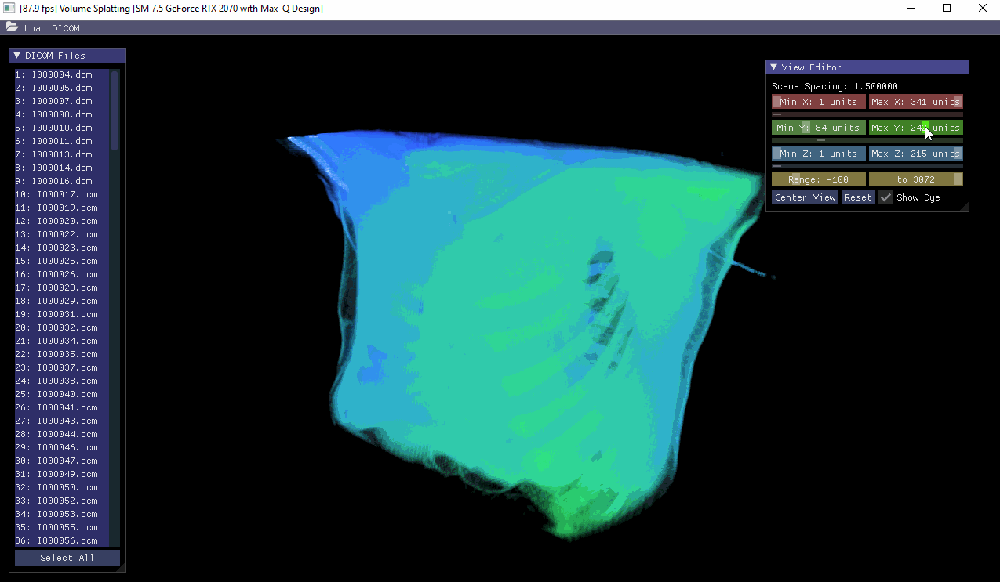

**University of Pennsylvania, Senior Design
Volume Splatting**

* Alexis Ward
  * [LinkedIn](https://www.linkedin.com/in/alexis-ward47/), [personal website](https://www.alexis-ward.tech/)
* Current configuration using: Windows 10 64-bit, i7-9750H CPU @ 2.60GHz 16GB, GeForce RTX 2070 Max-Q

# README

-To bring over from my notes.